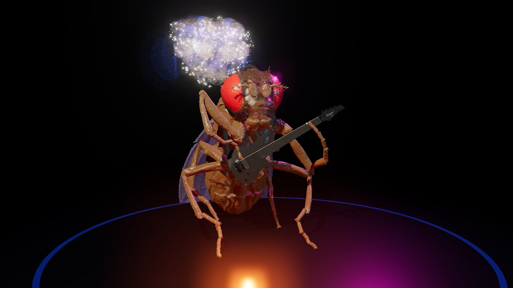
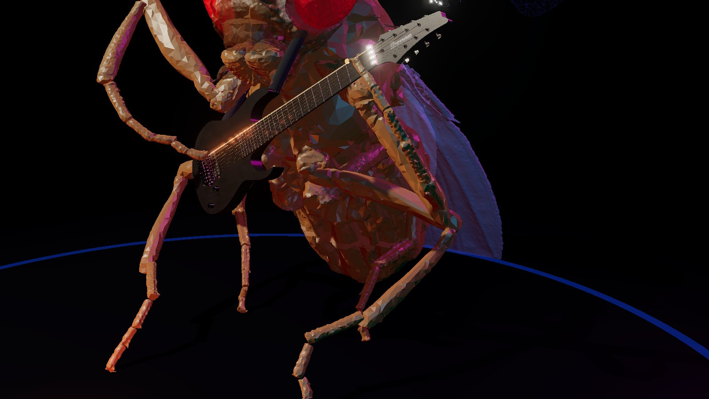
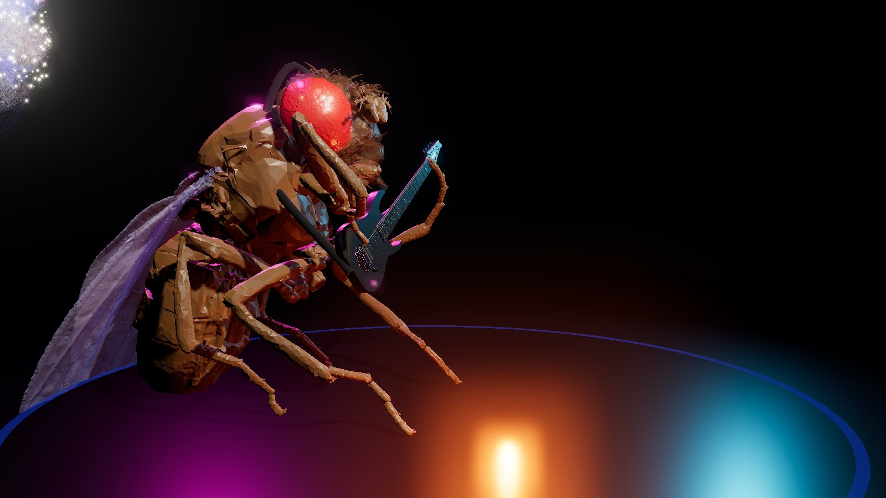
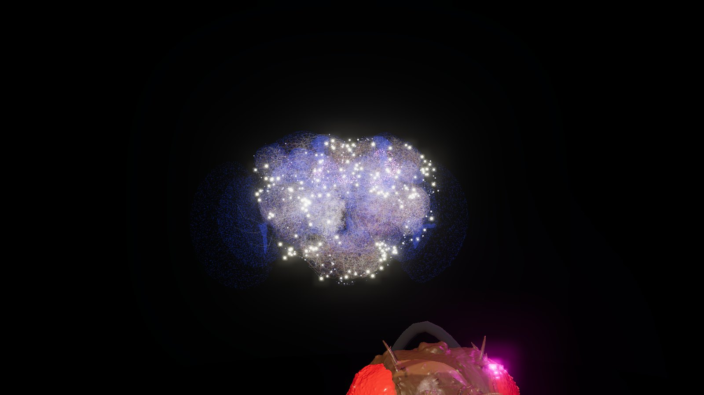
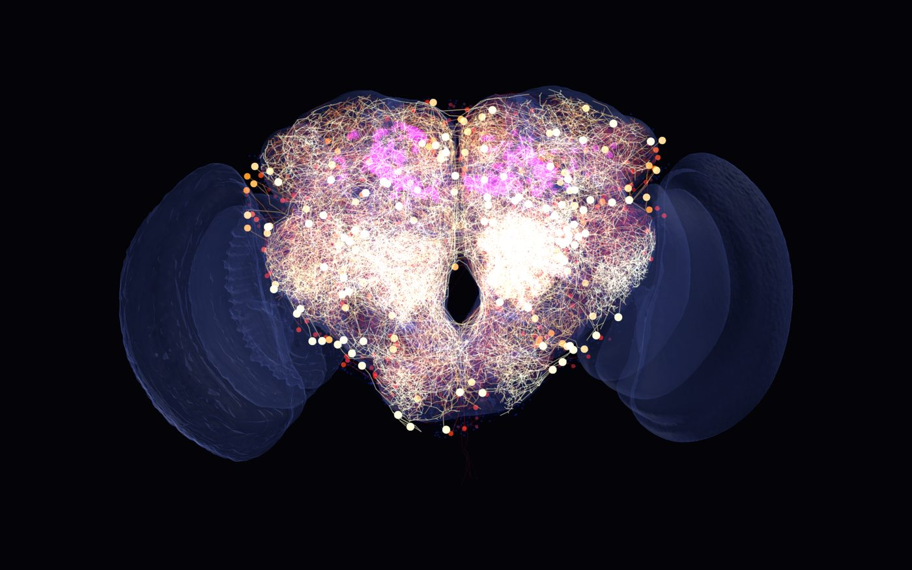

# Fruit Fly Djent

A male fruit fly's real synaptic wiring (the **MaleCNS** connectome) used as a fixed recurrent
reservoir that learns to play Meshuggah's *Rational Gaze* — rendered through the **8ridge lite**
8-string guitar engine, with the same neurons spiking in a **Brian2** simulation shown live on the
**NAVis** skeletons, and a **NeuroMechFly** fly body playing an **Ibanez M8M** on a three.js stage.

```
neuPrint (male-cns:v1.0) ──► 2,318 central-brain neurons + 332 PAM/PPL1 DANs, 236,870 edges
        │                                   │
        │ NAVis skeletons                    │ signed sparse W (NT sign, spectral radius 1.6)
        ▼                                   ▼
  octarine / three.js brain      leaky tanh reservoir  ◄── 4/4 pulse + riff-cycle pulse + form cues
  (spikes from Brian2 LIF)                  │ ridge regression readout (Stage A)
                                            ▼
                     MIDI ──► 8ridge lite sampler port (+ amp/cab) ──► stems / live audio / MIDI out
                                            │
                                            ▼
                     three.js stage: NeuroMechFly body, CCD-IK legs on an Ibanez M8M
```

Everything the plan asked for is implemented and verified (see *Results*): `PROJECT_PLAN.md` is the
original design document.

## The stage

| | |
|---|---|
|  |  |
| *Audience view* | *Fretboard camera* |
|  |  |
| *Side view* | *Brain camera* |



*The NAVis / octarine brain window at 40 s into the song: every skeleton drawn as one GPU line, coloured by its last spike; translucent shells are the brain regions.*

Press **X** on the stage page to save a screenshot like these to `output/screenshots/` (rendered frame, no HUD).

## Setup

```bash
python -m venv .venv
.venv/Scripts/python.exe -m pip install -r requirements.txt   # Windows; brian2 pinned to a wheel
cp .env.example .env                                           # put your neuPrint token in it
```

Third-party assets (not in git, see `.gitignore`):

* `third_party/8ridgelite` — `git clone https://github.com/JamesStubbsEng/8ridgelite` (GPL-3, 1.1 GB of
  guitar samples; the engine port reads `8ridgelite_20sec_wav/{Natural,Tuned}` or
  `C:\ProgramData\Haventone\Bridgelite` if the real plugin is installed).
* `third_party/neuromechfly` — the `mesh/`, `mjcf/`, `pose/` folders of the `flygym` wheel
  (NeuroMechFly v2, EPFL, Apache-2.0) — `pip download flygym --no-deps` and unzip.
* `data/rational_gaze.pdf` — the tab (tab-only Guitar Pro export). `.gp`/`.gp5` transcriptions work too.
* `data/rational_gaze_backing.mp3` — an optional backing track / recording (never downloaded by this code).
* `third_party/ibanez-m8m/source/IbanezM8M.obj` (+ PBR PNGs) — the Ibanez M8M mesh; `stage-export`
  converts it to `stage/data/guitar.glb` in the stage's guitar frame. Without it the stage uses the
  procedural M8M in `stage/guitar.js`.

## Commands

```bash
python -m fruit_fly_djent.cli pull          # neuPrint -> data/cache (neurons.parquet, edges.parquet)
python -m fruit_fly_djent.cli skeletons     # NAVis skeletons + 76 region meshes -> data/skeletons
python -m fruit_fly_djent.cli fit           # Stage A: drive reservoir, ridge-fit the readout
python -m fruit_fly_djent.cli compose       # replay -> output/fruit_fly_djent_rational_gaze.mid
python -m fruit_fly_djent.cli stems         # double-tracked guitar + drums + aligned backing + mix
python -m fruit_fly_djent.cli render        # quick single mix through the sampler port
python -m fruit_fly_djent.cli spikes        # Brian2 LIF whole-song raster -> data/cache/spikes.parquet
python -m fruit_fly_djent.cli shape         # Stage B: reward-modulated improvisation (CMA-ES)
python -m fruit_fly_djent.cli compose --stage-b
python -m fruit_fly_djent.cli stage-export  # geometry / notes / spikes / audio for stage/
python -m fruit_fly_djent.cli play          # audio + live NAVis brain window + stage websocket
python -m fruit_fly_djent.cli play --live   # step the numpy LIF in lockstep with the audio clock
python -m fruit_fly_djent.cli play --fly-only          # mute the backing track
python -m fruit_fly_djent.cli play --midi-out "loopMIDI Port"   # drive the real plugin
python -m fruit_fly_djent.cli play --improvise         # LIVE Stage B: the fly improvises on the song, phrase by phrase
python -m fruit_fly_djent.cli play --improvise --improv-off     # start faithful, switch learning on from the stage
python -m fruit_fly_djent.cli corpus                   # list the tabs in data/songs/ (transposed to the fly's tuning)
python -m fruit_fly_djent.cli fit-multi                # one read-out for every tab's riffs -> data/cache/model_multi.npz
python -m fruit_fly_djent.cli generate --bars 32 --bpm 140 --cycle 23 --density 9 --snare thirds   # offline riffs -> output/
python -m fruit_fly_djent.cli play --generate --phrase-bars 4 --bpm 140 --cycle 23 --density 9     # live; 👍/👎 steer it
python -m fruit_fly_djent.cli snapshot 20   # offscreen brain render at t = 20 s
python -m fruit_fly_djent.cli midi-ports
python -m fruit_fly_djent.cli controls      # shuffled / random reservoirs vs the real wiring -> output/controls.json
python -m fruit_fly_djent.stage_server      # serve stage/ on http://localhost:8000 (+ launcher API for the page's buttons)
```

**Running it from the page.** Serve the stage with `python -m fruit_fly_djent.stage_server` (or the
`stage` launch config) and open http://localhost:8000. The page's **⟲ Conductor** button starts
`cli play` for you (brain window + audio from Python, ~20–40 s to load), **🧠 Live learning** starts
`cli play --improvise` (or restarts a running conductor with it), **🎸 Own riffs** starts
`cli play --generate` (after `fit-multi`), and **■ Stop** kills it — the buttons
call the server's `/api/launch`, `/api/status`, `/api/stop`; the conductor's own log is
`output/conductor.log`. In conductor mode the *sound comes from Python*, not the browser: with no
conductor running the stage is silent, which is what the buttons now fix. "▶ Play (standalone)" is
the browser-only mode (pre-rendered stems, no live brain).

In the brain window: **G** toggles the fly's guitar, **B** the backing track, **D** the synth drums,
**L** live learning, **+** / **−** = 👍 / 👎 (with `--improvise` or `--generate`). On the stage: G/B/D,
L, **K** / **J** = 👍 / 👎.
On the stage page the same toggles are buttons (and the g/b/d keys); "Play — fly guitar only" starts with
the backing muted.

**Positioning the guitar by hand** (stage page): press **P** for placement mode — arrows move it
(←/→ fly's left/right, ↑/↓ up/down, Shift+↑/↓ or PgUp/PgDn toward/away from you), **Q/E** tilt the neck,
**A/D** swing it toward you, **Z/C** tip the face, **R** resets, **Enter** prints
`const GUITAR_DEFAULT = {...}` to the console. The values are shown in the status panel and remembered by
the browser; to make them permanent paste the printed line over `GUITAR_DEFAULT` in
[`stage/app.js`](stage/app.js) (dx/dy/dz are mm relative to the thorax: +dx toward the audience, +dy up,
+dz the fly's right; angles in degrees).

## How it works

**Connectome → reservoir** (`connectome.py`, `reservoir.py`). The top-2000 central-brain intrinsic
neurons by synapse count plus every PAM/PPL1 dopaminergic neuron; edge weight `1 + log(synapses)`,
sign from the presynaptic consensus neurotransmitter (ACh +, GABA/Glu −, monoamines +0.5 — a
simplification, real sign depends on the receptor). Dynamics
`x[t+1] = (1-a) x[t] + a tanh(W x[t] + W_in u[t] + b)` with heterogeneous leaks (time constants from a
32nd note to a riff cycle) and diverse biases. The wiring is never changed; only a global gain.

**Inputs** (`meter.py`). Three streams into disjoint random populations (30 % of neurons each):
the 4/4 drum pulse (quarter/downbeat/snare-on-3 pulses + a Fourier phase code of the bar), the riff
cycle (16th ticks, phrase-group starts + phase code — group starts come from the transcription's
annotations, or from the tab's repeat blocks), and the song form (section identity, section-start pulse,
within-section phase code). Without the phase codes the reservoir state is rank-20 and F1 stalls at 0.8.

**Stage A** (`train_supervised.py`): `W_out = (XᵀX + λI)⁻¹ XᵀY` on piano-roll targets (onset, sustain,
velocity), polyphonic decoding to MIDI. **Stage B** (`train_reward.py`, `fitness.py`): CMA-ES over
input gains, a rank-8 readout perturbation and the gain of a reward signal injected into the PAM (+) /
PPL1 (−) neurons; fitness = groove autocorrelation at the 25-sixteenth lag, low-string focus, chug
ratio, density, syncopation, pitch vocabulary, and a *novelty band* so it deviates without wandering.

**Transcriptions** (`pdftab.py`, `gpif.py`, `transcription.py`). A small OMR reads the tab-only PDF's
vector layer (stems, beams, flags, dots, rests, ties, repeats, endings, "3x", P.M., bends) — every
bar is checked to sum to 16 sixteenths. GP7 `.gp` files are parsed from their gpif XML; `.gp3-5` via
PyGuitarPro. Chords, ties and whole notes are handled.

**8ridge lite port** (`bridgelite.py`). A faithful reimplementation of the plugin's JUCE
`Synthesiser`/`SamplerVoice` (pitch ratio, linear interpolation, 5 ms/10 ms ADSR at the source rate,
velocity gain, same-note retrigger release, the `setRange(16, 28)` quirk that layers the repitched E1
sample under F1–G2). Not part of the plugin: an amp + 4x12 cab approximation, a full-GM procedural
drum kit, palm-mute articulation (only notes the tab marks P.M. are gated, to 75 % of their length)
and double-tracking (Natural set left,
Tuned set right, 7 ms late, humanised) for the record-style stereo guitar.

**Live Stage B** (`live.py`, `play --improvise`). The reward search runs *during the performance*.
Phrases are 8 bars (`--phrase-bars`). While phrase *k* plays, a planner process (with `--workers 4`
evaluation processes at below-normal priority) auditions candidates for phrase *k+1* through the
reservoir — from the exact state the brain will be in at the boundary, so no seams — grades each
with `fitness.py`, and keeps evolving one CMA-ES across the whole song (plus an elite re-audition of
the best knobs so far). ~2.5 s before the boundary the best candidate is committed: rendered through
the sampler port + amp (double-tracked, into running DI buffers so tails cross boundaries, one level
for the whole show) straight into the guitar stem the audio clock is streaming, sent to the stage /
MIDI, and written into the live LIF's "hears itself" input. Its fitness advantage over the running
average is the treat injected into PAM (+) / PPL1 (−) during the *next* phrase. The first phrase is
always the Stage A replay. Every run is a different take (`--seed` changes the search).

*The knobs are musical, not random.* A candidate is nine numbers (`unpack_knobs`): how hard the
drum / riff / form streams hit the brain; the dopamine gain; a **polymetric displacement** of the riff
and section material against the drum grid (in sixteenths); a **stretch** of the riff/section phase
(a new polymeter — 23/16, 27/16…); a **blend** of another section's identity into the form stream
(its material bleeds in) and which section; and the decode threshold (sparser ↔ denser). Every knob
transforms the *inputs* the read-out was trained on (`meter.build_streams_ex`), so the read-out
stays on ground it knows and the output stays clean — an earlier version shoved the read-out
weights randomly and produced off-grid blips and wrong notes. Guard-rails on top: the read-out is
masked to the pitches the tab uses in that phrase (weighted by how often), onsets snap to the 16th
grid and durations to whole sixteenths, the note count is capped near the tab's, the velocity is the
tab's; the fitness adds pitch balance (keep the section's chug / leap mix), density relative to the
tab and a novelty band. One knob, `--wildness` (default 0.3), scales the search width, the knob
ranges, the novelty band and the density cap.

*👍 / 👎 — the audience is part of the reward.* Press **K** / **J** (or the buttons in the stage's
live panel, or **+** / **−** in the brain window) while a phrase plays. The vote (i) adds ±0.5 to the
treat injected into the dopamine neurons for the next phrase, (ii) re-weights the scorer's components
toward the features of the phrase you liked (multiplicative update, clipped 0.2–4×; shown as
"taste" on the HUD), and (iii) nudges the CMA-ES mean toward the liked knobs (👍) or widens the
search (👎). The fly learns the listener's taste over the show.

**Many songs → riffs of its own** (`corpus.py`; `play --generate`). Drop Guitar Pro files (`.gp`,
`.gp5`, `.gp4`, `.gp3`) or tab-only Guitar Pro PDFs into `data/songs/` — the fly learns from *tabs*,
not audio (only a transcription gives the piano roll the read-out is fitted to). `cli corpus` lists
what loads: the rhythm-guitar track is picked automatically when none is called "Rhythm" (busy, low,
not lead/solo/clean/bass/drums — tabs name tracks after players, amps or nothing), and every song is
**transposed so its lowest open string is the fly's low F** (riff shapes survive, the F-standard
8-string on stage stays right). `cli fit-multi` fits **one read-out for all songs** on each song's
most characteristic **riffs** (`--bars-per-song 16`: whole sections ranked by notes × low-string
share) using a shared **section-code** form encoding (each song/section gets a fixed 16-dim ±1 code
instead of a per-song one-hot; Gram matrices accumulated song by song, one solve). A *linear* reader
of 2,318 neurons holds about one song (11 whole songs → F1 0.02; 11 riff excerpts → 0.66), so the
multi-song reader is a two-layer reader: `--expand 4000` random tanh features of the *same* neuron
states (it is still reading the brain, with a bigger pen) → **mean onset F1 0.96 over 11 songs**
(per-song numbers in `data/cache/corpus.json`). The generator then drives the same brain with a
*synthetic* song frame (a bar grid, riff cycles of `--cycle` sixteenths, one "section" per phrase)
whose section identity walks through the learned riffs — a seeded **set list**: every phrase starts
from a different learned song section, and the knobs choose a partner section to blend in (up to
50 %) plus the treatment (displacement, stretch, gains, threshold) — material the reader was never
shown in that combination. Each phrase is decoded with **that section's own vocabulary and density**
(from the per-section table `fit-multi` stores; `--density` overrides), graded with
`score_generated` (groove at the section's own riff cycle, chug ratio, syncopation, pitch balance
against the section) plus a **freshness** term against the previous phrase (so it cannot settle on
one riff — an earlier version did exactly that after ~1 minute: CMA-ES had converged and the same
knobs picked the same code every phrase; the search now also keeps a step-size floor), and played
over **its own drums**: hats keep the
tempo (every 8th, louder on the quarters, crash on the phrase downbeat), the **kick follows the riff**
(one under every guitar onset), the snare is the backbeat — `--snare 24` (beats 2 and 4) or
`--snare thirds` (every 3 sixteenths, the 3-against-4 displacement feel). `cli generate` does the
same offline into MIDI + WAV (`output/fruit_fly_djent_seed*.{mid,wav}`).

**Backing track** (`record.py`). Onset-envelope cross-correlation finds where bar 1 starts in the
recording and its tempo; stems are rendered at that tempo so the fly stays in sync.

**Spiking brain** (`snn.py`). LIF neurons with exponential synapses on the same wiring (inhibitory
synapses 4× stronger for balance), driven by the same meter input plus a "hears itself" note-onset
stream. Brian2 (numpy codegen) is the reference simulation; an equation-identical numpy LIF runs in
lockstep with the audio clock in `play --live`. **Viewer** (`neuroviz.py`): NAVis skeletons (healed,
Strahler-pruned, downsampled) drawn as one pygfx line with a per-vertex glow through a colormap
(blue → red → yellow), somas as points, PAM/PPL1 somas with a magenta halo, region meshes as shells.

**Stage** (`stage/`). NeuroMechFly's 70 MJCF bodies become named glTF nodes; the page drives the real
hinge joints (coxa yaw/pitch/roll, femur, tibia, tarsi) with a two-stage IK: the elbow is placed
analytically on the two-bone circle (coxa+femur vs tibia+tarsus lengths from the rig) closest to a pole
vector (`POLE_L`/`POLE_R` in `stage/app.js`, world space: each elbow out to its own side, forward and slightly down), then CCD reaches the elbow and the fingertip, so the left leg
frets the tab's actual string/fret on the mesh's measured fret wires (resting at the last fretted
position on open strings, with a glowing fret marker) and the right leg picks above the strings at the
bridge without crossing or clipping. Front-leg joint ranges are symmetric — the y-axis hinges are not
mirrored between sides, so the left leg needs the opposite bend sign from the right. Head-bangs on kick/snare, wings flare on accents. The guitar is the
M8M mesh measured for its bridge/nut/string plane (`stage_export.export_guitar`), with the procedural
model as fallback. The brain hologram uses a data texture of last-spike times and fades on the GPU.

## Results (this machine, RTX 2060 SUPER)

* Stage A replay of the PDF tab: **onset F1 0.990, pitch accuracy 1.000** (1,272 / 1,272 notes,
  `fit` takes ~4 s); the GP7 transcription: F1 0.989 / pitch 0.991 (1,493 notes).
* Stage B (25 generations × 8): fitness 0.726 vs 0.701 for the memorised riff (GP7 source: 0.789 vs 0.706).
* Brian2 whole song: 1.7 M spikes, 2.4 Hz mean, 85 s of compute; numpy LIF 2.7× real time.
* Stage: 60 fps with 920 k brain segments + the 24 MB fly + bloom.
* Live Stage B (`play --improvise`, 4 workers): 112–145 candidates auditioned per 8-bar phrase, phrase
  render 0.4–0.6 s; over 6 phrases 5 improvised with mean fitness 0.751 vs 0.746 for the replay
  (best phrase 0.795); the brain (numpy LIF) keeps up in real time alongside. Riff generator with the
  11-tab corpus (Meshuggah, Monuments, Periphery, Unprocessed): shared reader F1 0.96 on 16-bar riff
  excerpts; live, 4-bar riffs get 49–73 candidates each. With the guard-rails
  (`--wildness 0.3`): 58–67 notes per 8-bar phrase against the tab's 48–56, all on the 16th grid,
  section pitches only, novelty 0.40–0.66. Previews: `output/preview_live_improv_w035.mp3` /
  `_w070.mp3` (replay phrase + 4 improvised phrases over the backing, two wildness levels).

## Does the fly's wiring matter? (control experiments, `cli controls`)

Same inputs, same targets, same read-out fit — only the reservoir swapped (`output/controls.json`):

| reservoir | onset F1 | pitch acc |
|---|---|---|
| **real MaleCNS wiring** (2,318 neurons, 236,870 edges) | **0.990** | 1.000 |
| inputs only — no brain, linear read-out on the phase codes | 0.000 | — |
| the connectome with its synaptic partners shuffled | 0.995 | 1.000 |
| a random sparse network of the same size and density | 0.996 | 1.000 |
| a random network 10× smaller (231 units) | 0.087 | 0.881 |
| the real wiring with excitatory/inhibitory signs removed | 0.985 | 1.000 |

So Stage A needs *a* large, fixed, nonlinear reservoir — the fly's wiring is a perfectly good one but
not a special one: a shuffled or random network of the same size reproduces the song just as well,
and the inputs alone cannot. The notes in the MIDI are decoded from the (simulated) neural activity,
but their information content is the tab's; the connectome is the medium the song is written on,
not the composer. Say it that way.

## Caveats

* Neurotransmitter → sign is a simplification; the reservoir gain/leak conditioning is standard
  echo-state practice, not physiology. The MaleCNS dataset is CC-BY: cite Janelia FlyEM / the MaleCNS
  paper if you share results.
* The tab and the backing track are copyrighted third-party material: they are not redistributed.
* The real 8ridge lite plugin needs Visual Studio + JUCE/Projucer to build (`8StringDI.jucer`, VS2019
  exporter) and a virtual MIDI port (loopMIDI) to receive `play --midi-out`; the Python port plays
  the same samples in the meantime.

## Try it without installing anything

* **Hugging Face Space (ZeroGPU, free):** https://huggingface.co/spaces/SyhmZlkrn/djent-fruit-fly — everything in one
  page: pick bars, riff cycle, notes/bar, wildness, seed (drums optional) → the fly's brain makes up a riff (WAV + MIDI
  + a table of which learned riffs each phrase came from) → **👍 / 👎 it** (the vote becomes a treat into the dopaminergic
  neurons, re-weights the scorer and nudges the knob search for your *next* riff) → and **the NeuroMechFly plays your
  riff** on the M8M right below, with the same 2,318 neurons spiking above it (a LIF simulation hearing that riff,
  computed per run). Each run costs about a minute of the visitor's free daily ZeroGPU quota (log in for more). The live
  show — improvising on a real song in real time, votes while it plays — still needs a desktop.
* **How it works:** open [`docs/how_it_works.html`](docs/how_it_works.html) — pipeline diagrams, every step in plain
  words, the tools, and a timestamped build log with proof of every number.
* **Listen:** [`docs/audio/`](docs/audio/) — riffs the fly made up from the 19-tab corpus.

## What is *not* in this repository

Bring your own: the **tabs** (`data/rational_gaze.pdf` / `.gp` and `data/songs/*.gp` — copyrighted transcriptions),
the **backing track** (`data/rational_gaze_backing.mp3`), the **trained read-outs** (`data/cache/model_*.npz` —
the Stage A model reproduces the song note-for-note, so it is not shared), your **neuPrint token** (`.env`), the
**8ridge lite** plugin (clone it into `third_party/`), the **NeuroMechFly** assets (from `flygym`), and the
neuPrint caches (pulled with your token). See "Setup" above. The Ibanez M8M mesh *is* included (CC BY 4.0, see below).

## License

Code: **GPL-3.0** (`LICENSE`) — `fruit_fly_djent/bridgelite.py` is a port of the GPL-3.0 8ridge lite sampler
engine, so the project is GPL. Data and third-party assets keep their own licences; the full list with
attributions is in [`THIRD_PARTY_NOTICES.md`](THIRD_PARTY_NOTICES.md). In short:

* **MaleCNS v1.0** connectome — Janelia FlyEM via neuPrint — **CC BY 4.0**. Cite it if you publish results.
* **NeuroMechFly** body — EPFL (`flygym`) — **Apache-2.0**.
* **"Ibanez M8M"** 3D model (https://skfb.ly/pqrZM) by **cherepah** — **CC BY 4.0**.
* **8ridge lite** samples and sampler logic — James Stubbs — **GPL-3.0**.
* **three.js** — MIT.

*Rational Gaze* is by Meshuggah; the training corpus belongs to its writers. No transcription, recording or
model that reproduces a copyrighted song is distributed.
